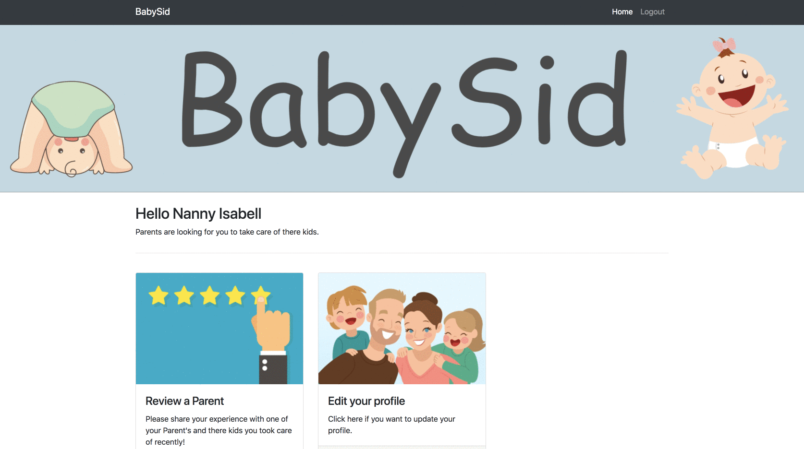

# BabySid is an App where Users can book a Nanny immedetaly

I used Java, SpringBoot, HTML5, Bootstrap, CSS3 and as a database MySQL.

First you can Register or Login as a Nanny or a Parent.

PARENT:
Can find Nannys close to his area and book the Nanny whenever it is possible.

The parent who booked a Nanny can first have a look at her information page. For example, if the Nanny come to the parents house,
if she is coming to the Parent house, how many Kids she/he take care of and also the contact details.

After booking the Nanny the Parent can give Reviews for the Nanny and the Rating is shown afterwards on the Nanny's page.

NANNY:
The Nanny has to Register and also send her Certificate that she/he is allowed to take care of kids. 
Otherwise the Nanny wouldn't be accepted on the program and she/he can't be booked.

